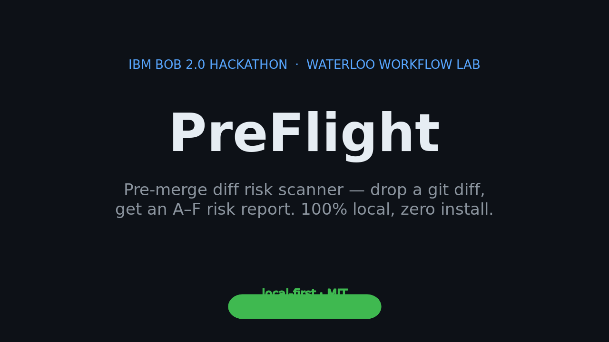
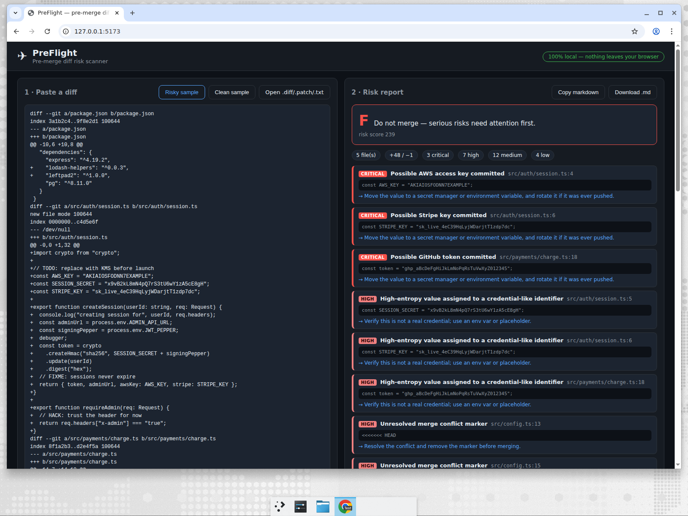

# PreFlight ✈



**Pre-merge diff risk scanner. Drop a `git diff` in, get a risk report out — 100% in your browser.**

PreFlight catches the stuff humans skim past right before merge: pasted
credentials, unresolved conflict markers, debug leftovers, migrations with no
rollback, undeclared env vars, `package.json` bumps without the lockfile,
sensitive-area churn, missing tests. Paste the diff → get an A–F grade,
severity-ordered findings, a reviewer checklist, and a markdown report you can
drop straight into the PR.

Everything runs locally in the page. Diffs routinely *contain* secrets —
that's the point of the tool — so they never leave your browser.

## Demo

- Live demo: https://sharonbasovich.github.io/preflight/ (deployed via GitHub
  Pages — workflow included, one setting flip required)
- Try the built-in **Risky sample** — a deliberately toxic diff — then the
  **Clean sample** for contrast.



## Run it

```bash
npm install
npm run dev        # dev server
npm test           # vitest suite
npm run typecheck  # strict tsc
npm run build      # production build → dist/
npm run preview    # serve the production build
```

No backend, no API keys, no env vars. Node 20+ only.

### CLI mode

The same engine runs in your terminal — handy as a pre-push gate:

```bash
npm run cli -- path/to/change.diff          # prints the markdown report
npm run --silent cli -- --json change.diff  # machine-readable findings for CI
npm run --silent cli -- --sarif change.diff # SARIF 2.1.0 log for code scanning
git diff main...HEAD | npm run cli           # or pipe a live diff
```

Exit code is 1 when the grade is C/D/F, so it drops straight into a
`pre-push` hook or CI step.

## CI integration

PreFlight dog-foods itself via [`.github/workflows/dogfood.yml`](.github/workflows/dogfood.yml).
On every pull request the workflow:

1. Generates a diff against the base branch and runs the CLI scanner.
2. Uploads `preflight-report.md` and `preflight-findings.json` as a build artifact.
3. Posts (or updates) a single PR comment containing the full markdown report,
   tagged with a hidden `<!-- preflight-report -->` marker so reruns replace
   the existing comment instead of adding new ones.

Forked PRs receive a read-only token from GitHub — the comment step uses
`continue-on-error: true` so a permission denial never fails the scan job;
the artifact is always available as a fallback.

## How it works

```
diff text ──▶ parser (src/diff.ts) ──▶ rule engine (src/rules.ts)
                                              │
                                              ▼
              report (src/report.ts) ◀── scoring (src/score.ts)
```

- **Parser** — unified-diff grammar: `diff --git` headers, `/dev/null`
  add/delete, renames, hunks with real new-file line numbers, binary blobs,
  bare `---/+++` diffs without git headers.
- **Rules** — 12 focused checks, each a pure function over the parsed diff:
  secret literals (AWS/GitHub/Stripe/Slack/JWT/DB-URL formats), high-entropy
  credential assignments, conflict markers, debug output, TODO/FIXME,
  security-sensitive paths, dependency manifests, lockfile drift, irreversible
  migrations, undeclared env vars, missing tests, diff size.
- **Scoring** — severity-weighted with diminishing returns per rule, so a
  hundred TODOs can't outweigh one AWS key.
- **Report** — markdown table + reviewer checklist, clipboard-ready.

## Architecture

Vanilla TypeScript + Vite. No framework — the whole UI is ~200 lines of DOM
code. The analysis engine is dependency-free and importable on its own (CI
mode is a roadmap item).

## Testing

`npm test` — 33 vitest cases covering the parser (multi-file, /dev/null,
binary, headerless diffs), every rule's positive and negative paths, the
grading bands, and the report generator.

## How we used IBM Bob 2.0 vs. Devin — honestly

The overnight MVP was built by **Devin** (Cognition's AI agent) under an
automation, because Bob access is bound to the hackathon-provisioned IBM
account that only Sharon can sign in to. Bob's contribution lands when she
runs the tasks in [`docs/BOB_ACCESS.md`](docs/BOB_ACCESS.md) and exports the
session reports into [`bob_sessions/`](bob_sessions/). The running tally lives
in [`docs/BOB_USAGE.md`](docs/BOB_USAGE.md). Nothing here is faked — the
`bob_sessions/` exports are the source of truth for the judges.

## License

MIT — see [LICENSE](LICENSE).
